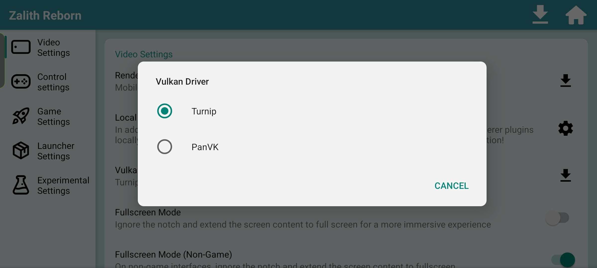

# PanVK Driver Plugin
An Simple App Plugin That Enables The Use Of Mesa 3D's PanVK Vulkan Driver For Mali GPU Devices.

# Why I'm Making This? 
A Vulkan Driver Plugin For Zalith Launcher That Enables The Use Of Vulkan API On Unsupported Devices With Mali GPUs. PanVK Is Basically Turnip But For Mali GPUs. It Makes Vulkan Work On Unsupported Devices By Replacing The System Vulkan Driver With Mesa's PanVK Driver That Can Fill The Extension Or Feature Gaps In System Vulkan Driver. **BUT NOTE THAT IF YOUR DEVICE SUPPORTS NATIVE VULKAN, YOU DON'T NEED TO USE THIS. SYSTEM VULKAN DRIVERS ARE WAY STRONGER THAN 3RD PARTY DRIVERS LIKE THIS. SO IF YOUR DEVICE SUPPORTS IT, TURN ON "USE SYSTEM VULKAN DRIVER" OPTION AND PLAY** Check If Your Device Is Compatible Or Not By Using TOWO's Vulkan Extension Checker: https://drive.google.com/file/d/1Gnpq_ndy3Qz916Y6i9KeA3qaHJKGVsbW/view?usp=sharing

**ONLY USE PANVK DRIVER IF IT SAYS "FAILED", IF SAYS "PASSED" USE SYSTEM VULKAN DRIVER. I'M REMINDING YOU AGAIN!**

# Installation Guide

Installation Process Is Super Simple. Follow The Steps Below:

1. Download The Apk From The Latest Release.
2. Install The App
3. Open The App Once
4. Open Zalith Launcher And Go To Settings
5. Go To Vulkan Driver Option And Select **"PanVK"**
6. Set The Renderer To **"Vulkan Zink"**
7. You're Done!
 

# What About Other GPUs?
Excluding Iphones,

We Mainly Have Three GPUs

1. Adreno
2. Mali
3. PowerVR

Adreno Are Snapdragon Only
Mali Are Most Widely Used By Different Chip Brands
PowerVR Is Very Rare On Android, Ones It Was Primarily Used On Iphone And Apple's A Series SoCs As GPUs. In Mordern Day, PowerVR Is Only Available On MediaTek Dimensity 7025 And And Google Tensor 5.

For Adreno GPU Users, There Is An Built-in Turnip Driver Inside Zalith But It's Not Very Good, So Adreno Users, Use The PurpleVK Driver Plugin: https://github.com/FCL-Team/FCLDriverPlugin

For PowerVR: Although These GPUs Are Extremely Rare. I Already Have Plans To Make A Mesa Vulkan Driver Plugin For PowerVR GPUs Too. Similar To What I Did For Mali GPUs. It's Mesa's PVRVK Driver And I'll Make A Plugin For It Soon! Stay Tuned...

# IT WON'T WORK! 
Why?
Answer: PanVK Is Not Something You Just Plug In And Play. PanVK Libs Must Be Patched And Intergreted Inside Zalith Code Otherwise It Wouldn't Work. No One Has Done That Till Now. I Have Plans But Not Sure I Can Or Not I Don't Have Proper Time Or Skills For Such Big Projects. I Will Change This Notice If I Find Any Solution. But For Now, The Source Code And Apk Are Here For People Who Want To See The Code, Edit It Or Make Something New And Useful. Until I Find Any Solution. 

# Credits
I'm Just A Simple Person Who Made The App Plugin And Integrated The PanVK File Inside. All Credits To Collabora And Mesa 3D Graphics Developers For Making This.

Visit Them Here:

https://www.collabora.com/

https://www.mesa3d.org/ 

# Code Usage And Forking

This Project Is Completely Open-Source And Under Apache-2.0 License, Which Is Very Permissible. Forking Is Allowed. You Are Completely Allowed To Use My Code For Learning, Editing And Building New Things With It. But You're Not Allowed To Take Full Ownership Of The App Itself.
